# myastro360 — System Architecture

A detailed reference for the deployment topology, backend strategy, frontend architecture, and data flows of myastro360 (the multi-tradition AI astrology platform). All diagrams use Mermaid and render natively on GitHub.

## Table of Contents

1. [System Overview](#1-system-overview)
2. [High-level Architecture](#2-high-level-architecture)
3. [Frontend Architecture (Next.js)](#3-frontend-architecture-nextjs)
4. [Backend Architecture (NestJS)](#4-backend-architecture-nestjs)
5. [Data Layer](#5-data-layer)
6. [AI / LLM Architecture](#6-ai--llm-architecture)
7. [Authentication & Authorization](#7-authentication--authorization)
8. [Critical User Flows](#8-critical-user-flows)
9. [Deployment Strategy](#9-deployment-strategy)
10. [CI/CD Pipeline](#10-cicd-pipeline)
11. [Observability](#11-observability)
12. [Domains, DNS, and Networking](#12-domains-dns-and-networking)
13. [Scaling & Cost Model](#13-scaling--cost-model)

---

## 1. System Overview

myastro360 is a turborepo monorepo with two deployable apps plus shared infrastructure:

| App | Stack | Port | Role |
|-----|-------|------|------|
| `apps/web` | Next.js 16 (App Router) + React 19 + Tailwind 4 + Zustand | 3000 | Public site, user dashboard, admin console |
| `apps/api` | NestJS 11 + Prisma 7 + BullMQ + ioredis | 4000 | REST API, AI orchestration, payments, background jobs |

**Tradition coverage:** Vedic, Western, Chinese, Hellenistic, Horary, Medical, KP, Divisional, Numerology, Palmistry, Tarot, Vastu, Muhurat — each surfaced as a dedicated route on the frontend and a knowledge-base partition on the backend.

**Languages:** 12 Indian languages + English (en, hi, ta, te, bn, mr, gu, kn, ml, pa, or, as) with dynamic on-demand bundle loading.

---

## 2. High-level Architecture

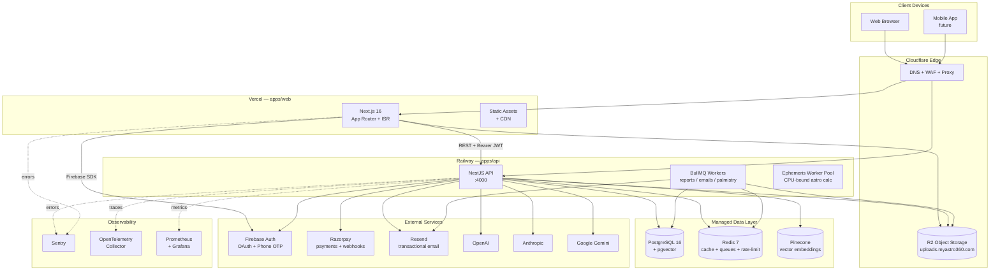

---

## 3. Frontend Architecture (Next.js)

### 3.1 Module map

```mermaid
graph LR
    Layout[layout.tsx<br/>root wrapper]
    Layout --> Navbar
    Layout --> TradRail[TraditionRail]
    Layout --> Chips[FeatureChips]
    Layout --> Banner[ImpersonationBanner]
    Layout --> Gate[ProfileGate]
    Layout --> Footer

    Gate --> Routes{App Routes}

    Routes --> Auth[/auth]
    Routes --> MyDay[/my-day]
    Routes --> Profile[/profile]
    Routes --> Chat[/chat]
    Routes --> Kundli[/kundli<br/>+/city/]
    Routes --> Horo[/horoscope/sign/]
    Routes --> Panch[/panchang<br/>+/city/]
    Routes --> Match[/matching]
    Routes --> Reports[/reports]
    Routes --> Tarot[/tarot]
    Routes --> Palm[/palmistry]
    Routes --> Num[/numerology]
    Routes --> Vastu[/vastu]
    Routes --> Trad[/vedic /western /chinese<br/>/hellenistic /horary /medical<br/>/kp-astrology /divisional]
    Routes --> Pricing[/pricing]
    Routes --> Admin[/admin]
```

### 3.2 State, API, and i18n

- **State (`apps/web/src/lib/store.ts`)** — Zustand with `persist` middleware. Persisted slice: `myastro360-auth` (user, accessToken, refreshToken, isAuthenticated). On logout the store also clears `myastro360-locale` and `myastro360-my-day-briefing`.
- **API client (`apps/web/src/lib/api.ts`)** — Fetch wrapper with auto-injection of `Authorization: Bearer <accessToken>`, 30s default timeout (60s for uploads), automatic 401 → `/auth/refresh` flow, and an `ApiError` class that distinguishes timeout, network, and HTTP errors.
- **i18n (`apps/web/src/i18n/`)** — English statically imported; 11 other locales are dynamic imports loaded on first use. Active locale persists to `myastro360-locale`. `useTranslation()` is the consumer hook.
- **SEO (`apps/web/src/lib/seo/server-api.ts`, `app/sitemap.ts`, `app/robots.ts`)** — Dynamic sitemap covering 12 zodiac sign pages, ~100 city panchang pages, ~100 city kundli pages. ISR with revalidate tags for panchang (6h) and horoscope (24h). Localized landing pages (horoscope/panchang/feature pages) are served under `/<locale>/…` via the `app/[locale]/` segment, with localized `<title>`/description, hreflang and canonical generated server-side; English lives at the root and wins by static-route precedence.
- **`<html lang>` trade-off** — The root `app/layout.tsx` renders a *static* `lang="en"`; `HtmlLangSync` (client) patches it to the active locale after hydration. The root layout sits above the `[locale]` segment so it can't read the locale from params, and using `headers()` to derive it would force the whole app dynamic and kill SSG/ISR. The strong language signals (hreflang, canonical, translated SSR content) are correct at first byte; only the `lang` attribute on the 11 prefixed locales is client-corrected. The SSR-correct alternative — rooting all routes under `[locale]` with a rewrite middleware — was evaluated and deferred as too large for the marginal payoff.
- **Offline engine (`apps/web/src/lib/offline-engine.ts`)** — Pure-JS Chaldean/Pythagorean numerology, planetary hours, basic panchang. Lets the future mobile app function without network.
- **Experiments (`apps/web/src/lib/experiment.ts`)** — Anonymous cookie `myastro360.exp.anon` (1-year TTL) buckets users into paywall variants before signup; `linkAnonymousAssignment()` stitches them to the user record after auth.

### 3.3 Global wrappers (top-down)

| Component | File | Purpose |
|-----------|------|---------|
| `ImpersonationBanner` | `components/auth/ImpersonationBanner.tsx` | Red banner if JWT carries `impersonatedBy` |
| `ImpersonateHandler` | `components/auth/ImpersonateHandler.tsx` | Swaps token on `?__imp=…` SSO handoff |
| `Navbar` | `components/layout/Navbar.tsx` | Fixed top nav, auth state, credit balance |
| `TraditionRail` | `components/layout/TraditionRail.tsx` | Sticky sidebar, tradition switcher |
| `FeatureChips` | `components/layout/FeatureChips.tsx` | Sticky quick-access feature chips |
| `RouteFocusReset` | `components/layout/RouteFocusReset.tsx` | A11y: moves focus to `<main>` on nav |
| `ProfileGate` | `components/auth/ProfileGate.tsx` | Redirects unauthenticated/incomplete users |
| `Footer` | `components/layout/Footer.tsx` | Site-wide footer |

---

## 4. Backend Architecture (NestJS)

### 4.1 Module map

```mermaid
graph TB
    Main[main.ts<br/>bootstrap]
    Main --> AppMod[AppModule]

    AppMod --> Auth[auth<br/>JWT + Firebase]
    AppMod --> User[user<br/>profile + credits]
    AppMod --> Astro[astrology<br/>readings]
    AppMod --> Chat[chat<br/>multi-turn AI]
    AppMod --> Kundli[kundli<br/>birth chart]
    AppMod --> Num[numerology]
    AppMod --> Palm[palmistry]
    AppMod --> Tarot[tarot]
    AppMod --> Vastu[vastu]
    AppMod --> Match[matching]
    AppMod --> Report[report<br/>async PDF gen]
    AppMod --> Brief[daily-briefing<br/>cron + email]
    AppMod --> Pay[payment<br/>Razorpay]
    AppMod --> Ref[referral]
    AppMod --> Notif[notification]
    AppMod --> Exp[experiment]
    AppMod --> Admin[admin<br/>+ GDPR]

    AppMod --> LLM[llm/<br/>provider router]
    AppMod --> AIA[ai/agents/<br/>9 domain agents]
    AppMod --> Eph[ephemeris/<br/>worker pool]
    AppMod --> Storage[storage/<br/>R2 + presigned]
    AppMod --> RedisM[redis/]
    AppMod --> Trace[tracing.ts<br/>OTEL]
    AppMod --> Metrics[metrics/<br/>Prometheus]
```

### 4.2 Modules at a glance

| Module | Path | Purpose |
|--------|------|---------|
| `auth` | `src/modules/auth/` | JWT issuance + refresh, Firebase ID-token verification, OTP, OAuth, admin bootstrap |
| `user` | `src/modules/user/` | Profile, preferences, credit ledger |
| `astrology` | `src/modules/astrology/` | Vedic & Western chart computation entry points |
| `chat` | `src/modules/chat/` | Streaming multi-turn AI chat (partitioned chat_messages) |
| `daily-briefing` | `src/modules/daily-briefing/` | Scheduled UTC cron, Resend email delivery |
| `experiment` | `src/modules/experiment/` | Paywall A/B test, anonymous → authed linking |
| `notification` | `src/modules/notification/` | Push/in-app notifications (partitioned table) |
| `numerology`, `palmistry`, `tarot`, `vastu` | `src/modules/<feature>/` | Feature endpoints |
| `payment` | `src/modules/payment/` | Razorpay orders, subscriptions, HMAC webhook verification |
| `referral` | `src/modules/referral/` | Referral codes, bonus tracking |
| `report` | `src/modules/report/` | Async report queue (Life / Career / Marriage / Wealth / Palm / Annual) |
| `admin` | `src/modules/admin/` | User/role management, impersonation, GDPR purge |

### 4.3 Bootstrap (`apps/api/src/main.ts`)

- **Global prefix** `/api`, bound to `0.0.0.0:4000` (container-friendly).
- **CORS** whitelists `localhost:3000/5173/8081`, all `myastro360.com` variants, plus `FRONTEND_URL` / `CORS_ORIGIN` env values.
- **Helmet** security headers, **ValidationPipe** with `whitelist + transform + forbidUnknown`.
- **Swagger** at `/api/docs`, gated by `ENABLE_SWAGGER=true`.
- **Sentry** initialized first (0.1 % prod sample rate, 100 % dev).
- **OpenTelemetry** loaded *before* anything else via `tracing.ts` so all spans are captured.
- **Graceful shutdown** on `SIGTERM` / `SIGINT` → `app.close()` drains in-flight requests and BullMQ jobs.

---

## 5. Data Layer

### 5.1 Stores

| Store | Engine | Role |
|-------|--------|------|
| Primary DB | PostgreSQL 16 + `pgvector` (Supabase managed; DO managed PG in Phase 2) | All transactional state, embeddings inline |
| Cache + Queues | Redis 7 (Upstash / managed DO) | Session cache, rate limit, BullMQ jobs, hot site-settings |
| Vector DB (optional) | Pinecone | Knowledge-base retrieval at scale (alternative to pgvector) |
| Object Storage | Cloudflare R2 (S3-compat) | Palmistry uploads, generated reports, exports |

### 5.2 Core schema (high-level ER)

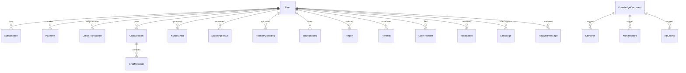

**Partitioned hot tables** (`createdAt` range partitions): `chat_message`, `notification`, `activity_log`, `llm_usage`. Monthly partitions; old partitions archived per `DATA_RETENTION_MONTHS`.

**Knowledge-base tables** (`Kb*` prefix): `KbPlanet`, `KbNakshatra`, `KbTithi`, `KbYoga`, `KbZodiacSign`, `KbNumber`, `KbDosha`, … — structured i18n facts that the agents combine with RAG retrieval for deterministic-but-rich responses.

**Migrations** (`apps/api/prisma/migrations/`): 20+ migrations, including `pgvector` extension enablement, partitioning conversions, Hellenistic/Horary/Medical tradition columns, and LLM ops columns (`duration_ms`, `cache_hit`, `error_code`, `retry_count`).

### 5.3 Connection pooling

- Local dev uses **PgBouncer** (transaction mode, port 6432) in front of Postgres.
- Managed prod typically uses Supabase's transaction pooler on `:6543`.
- Prisma is configured with the `adapter-pg` driver for pooler compatibility.

---

## 6. AI / LLM Architecture

### 6.1 Provider router with failover

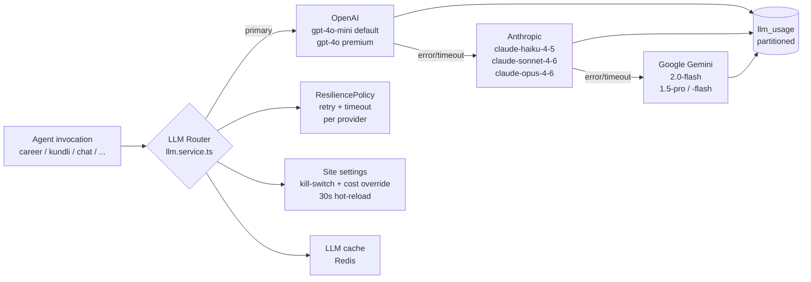

**Why this matters operationally:**

- A single provider outage doesn't take the product down — the next provider in the chain handles the request.
- Admin can disable a provider or override its per-1M token cost from the dashboard; settings hot-reload every 30 seconds via Redis.
- Every call writes to `llm_usage` (partitioned): `provider`, `model`, `tokens_in/out`, `cost_usd`, `duration_ms`, `cache_hit`, `error_code`, `retry_count`. This powers cost dashboards, budget alerts, and the daily `StatDaily` rollup.

### 6.2 Agents

All inherit from `BaseAgent` (`apps/api/src/ai/agents/base-agent.ts`) which handles system-prompt injection, user-context enrichment (DOB, name, zodiac, primary tradition), and RAG retrieval against `KnowledgeDocument`.

| Agent | Domain |
|-------|--------|
| `kundli-agent` | Birth chart interpretation, planetary positions |
| `career-agent` | Profession guidance |
| `wealth-agent` | Financial forecast, business sector recs |
| `relationship-agent` | Compatibility, synastry |
| `health-agent` | Constitution / dosha analysis |
| `palmistry-agent` | Hand image features |
| `numerology-agent` | Life path, destiny, soul, personality |
| `remedy-agent` | Doshas → ritual / gemstone / mantra recs |

### 6.3 Background jobs (BullMQ)

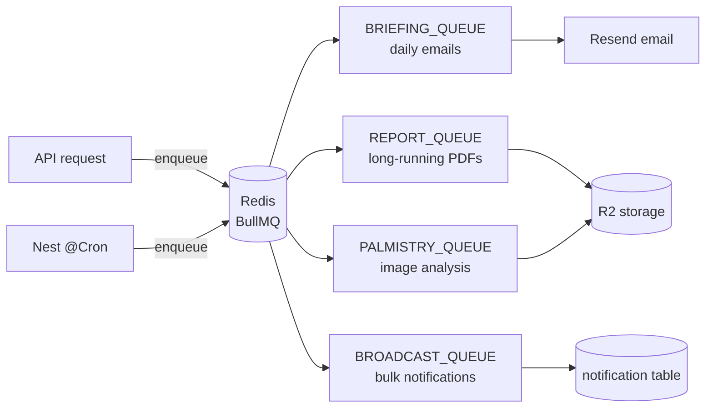

Plus an **ephemeris worker pool** (`apps/api/src/ephemeris/`) — Node worker threads that handle CPU-bound planetary calculations so they don't block the event loop.

---

## 7. Authentication & Authorization

### 7.1 Mechanisms

- **Firebase** handles the credential side: phone OTP, email/password, Google OAuth, password reset links.
- **NestJS** issues its own JWT pair (access + refresh) so every API call is decoupled from Firebase's network.
- **Redis** stores token revocation lists and rate-limit counters via `ThrottlerStorageRedisService`.
- **Admin bootstrap** (`AdminBootstrapService`) auto-creates a default admin on first boot if `ADMIN_EMAIL` + `ADMIN_PASSWORD` are set; refuses to invent a password in production.

### 7.2 Sign-up sequence

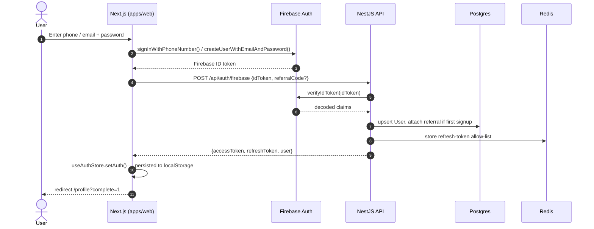

### 7.3 Authenticated request flow

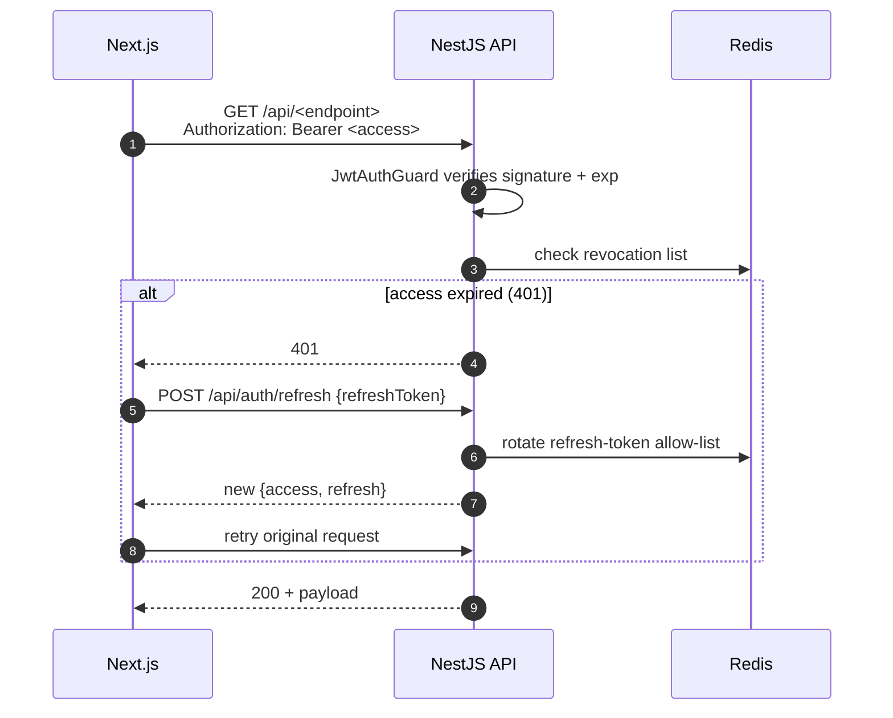

---

## 8. Critical User Flows

### 8.1 Generate kundli

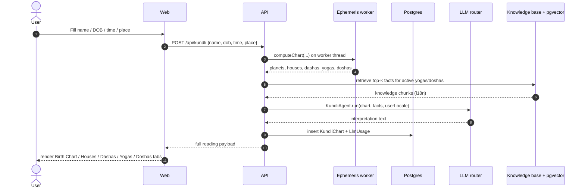

### 8.2 Chat with AI astrologer

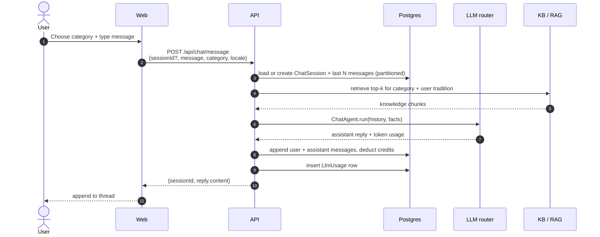

### 8.3 Async report generation

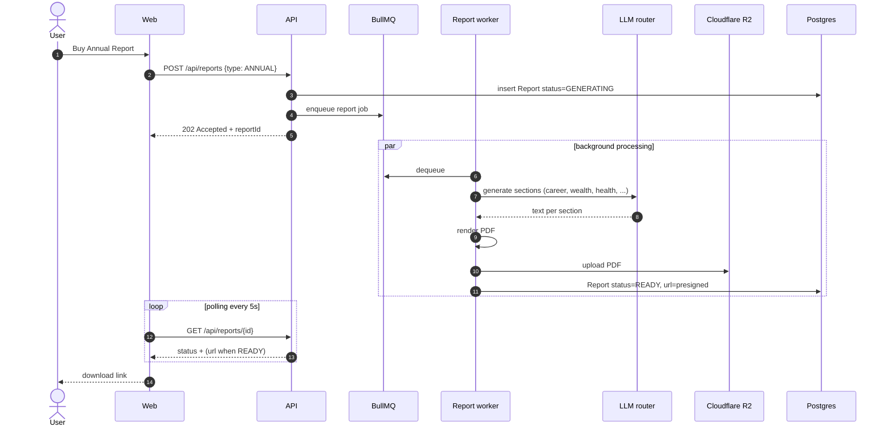

### 8.4 Payment + credits

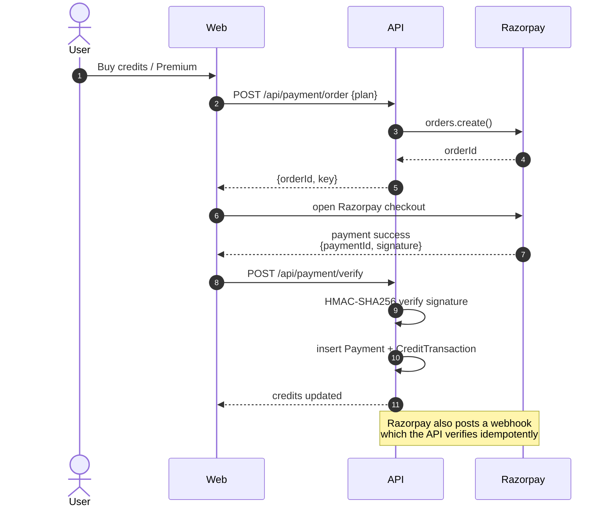

---

## 9. Deployment Strategy

The repo encodes a **three-phase** progression. Phase 1 is the current/near-term reality; Phases 2 and 3 are forward-looking but the manifests already exist.

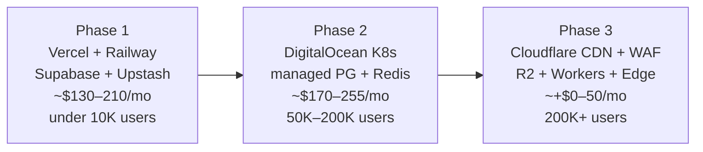

### 9.1 Phase 1 — current

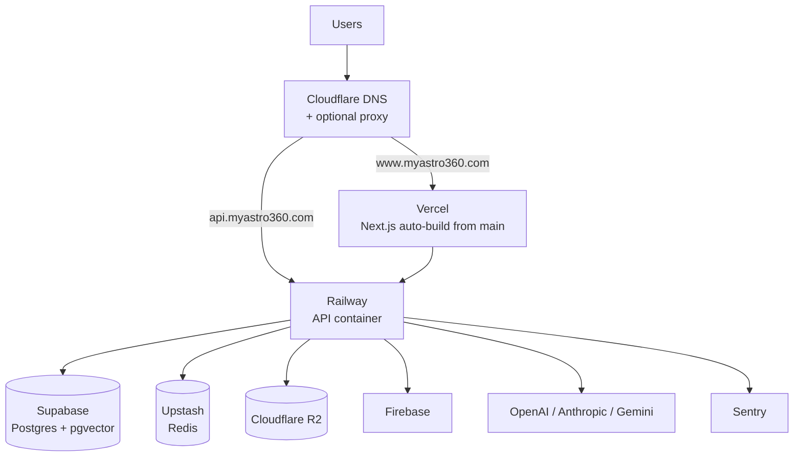

**Active components today**:
- Frontend: Vercel (Next.js auto-deploy from `main`, env vars in Vercel dashboard).
- Backend: **Railway** — origin `ishxajzg.up.railway.app`, with the CNAME `api.myastro360.com` pointing at it. (Previously Render at `jyotryx.onrender.com`, now retired.) ⚠️ Railway **suspends the service on a pending or failed payment** — the most common prod-down cause; see the [Incident Runbook](DEPLOYMENT.md#incident-runbook--troubleshooting).
- Image registry: `ghcr.io/xploroshan/myastro360-api:latest` published by GitHub Actions on every push to `main` that touches `apps/api/**`.
- Local dev: `docker-compose.yml` brings up Postgres + pgvector, Redis, PgBouncer, pgAdmin, API, and web in one command.

### 9.2 Phase 2 — Kubernetes on DigitalOcean

`k8s/base/` already contains a full Kustomize overlay:

| Resource | File | Detail |
|----------|------|--------|
| Namespace | `namespace.yaml` | `myastro360` |
| Deployments | `api-deployment.yaml`, `web-deployment.yaml`, `worker-deployment.yaml` | 3 / 2 / 2 replicas baseline; CPU 500m–2 cores, RAM 512Mi–1Gi |
| Services | `api-service.yaml`, `web-service.yaml` | ClusterIP, ports 4000 / 3000 |
| HPA | `api-hpa.yaml`, `web-hpa.yaml`, `worker-hpa.yaml` | 3–16 / 2–10 / 2–8 replicas; CPU 70 % / Mem 80 % |
| Ingress | `ingress.yaml` | nginx, cert-manager TLS, routes `api.` and `www.` |
| PDB | `api-pdb.yaml` | Keep ≥ 2 API replicas during voluntary disruptions |
| Config | `configmap.yaml`, `secrets.yaml` | Non-secret + secret env injection |

Probes: readiness `/api/health/ready` (DB + Redis check, 10 s delay, 10 s period, 3 fails to evict), liveness `/api/health/live` (15 s delay, 15 s period), graceful shutdown 30 s.

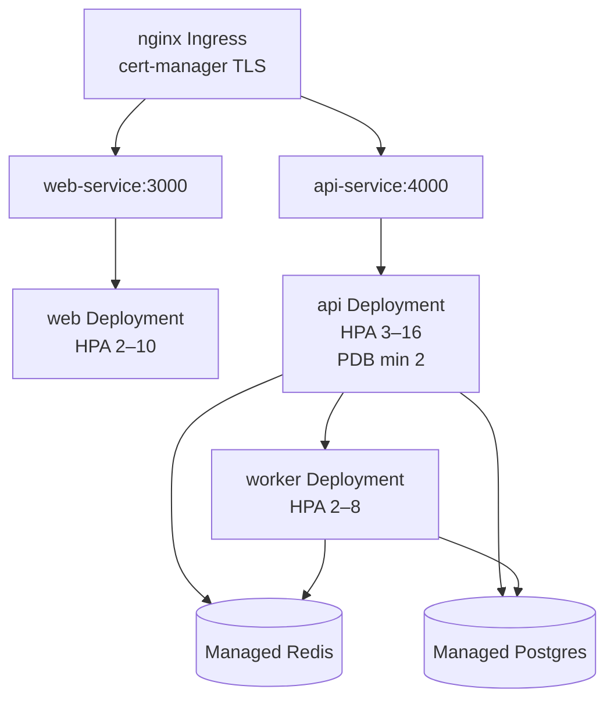

### 9.3 Phase 3 — Cloudflare edge

- DNS proxy ON for `www.`, off for `api.` (or proxied with WebSocket + grpc allowed).
- Page rules + WAF rules + bot mitigation.
- R2 fronted by `uploads.myastro360.com` for image CDN.
- Optional Workers in front of `api.` for rate limit + early auth-token reject.

---

## 10. CI/CD Pipeline

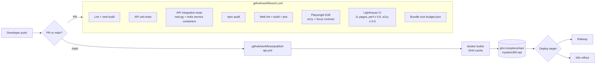

**ci.yml** (every push + PR to `main` / `develop`):

- **lint-and-test-api** — lints, unit + integration tests against real `pgvector:pg16` and `redis:7` service containers; spawns PgBouncer + Redis for the integration tier.
- **security-audit** — `npm audit` at high/critical threshold.
- **build-and-test-web** — lint, `next build`, vitest, uploads `.next` artifact.
- **e2e-web** — Playwright a11y + focus-reset contract.
- **lighthouse** — runs against 11 KB pages, asserts FCP ≤ 2 s, LCP ≤ 3.5 s, TBT ≤ 300 ms, CLS ≤ 0.1.
- **bundle-size** — enforces per-chunk budget from `budget.json`.

**publish-api.yml** (push to `main` touching `apps/api/**`): builds and pushes `ghcr.io/<owner>/myastro360-api:{latest,sha-<commit>}` with Buildx + GHA cache (cold ~6 min, warm ~90 s). Uses `GITHUB_TOKEN` with `packages: write` — no PAT needed.

---

## 11. Observability

### 11.1 Stack

| Layer | Tool | Where |
|-------|------|-------|
| Error tracking | Sentry | API: `@sentry/node` in `main.ts`; Web: `@sentry/nextjs` in `sentry.{client,server}.config.ts` |
| Tracing | OpenTelemetry | `apps/api/src/tracing.ts` (NodeSDK, OTLP HTTP exporter, auto-instruments HTTP / Express / ioredis / Prisma) |
| Metrics | Prometheus | `apps/api/src/metrics/`, served on `/api/metrics`; Phase 2 scraped by kube-prometheus-stack |
| Logging | NestJS Logger + Sentry breadcrumbs | Structured per-request; admin-action audit log table separately |
| Synthetic | Lighthouse CI in GitHub Actions | Asserts perf, a11y, FCP, LCP, TBT, CLS per release |

### 11.2 Domain telemetry

- **`llm_usage`** (partitioned) drives a daily `StatDaily` rollup for revenue / cost / margin dashboards.
- **`activity_log`** (partitioned) captures admin actions for GDPR audit.
- **`notification`** (partitioned) is both a feature table and a delivery audit trail.
- **`flagged_message`** records safety-net hits from the chat moderation pass.

---

## 12. Domains, DNS, and Networking

| Hostname | Resolves to | Cloudflare proxy | Purpose |
|----------|-------------|------------------|---------|
| `myastro360.com` (apex) | Redirect → `www.myastro360.com` | — | Bare domain |
| `www.myastro360.com` | `cname.vercel-dns.com` | OFF (Vercel handles TLS) | Frontend |
| `api.myastro360.com` | Railway CNAME | OFF (origin handles TLS) | Backend API |
| `uploads.myastro360.com` | Cloudflare R2 custom domain | ON | Public R2 bucket |

**Cloudflare Tunnel** (`cloudflare-tunnel.yml`) is a fallback for local-origin deployments — routes `api.` to `localhost:4000` and `www.` to `localhost:3000` via `cloudflared tunnel`. Useful in early dev / self-hosted scenarios.

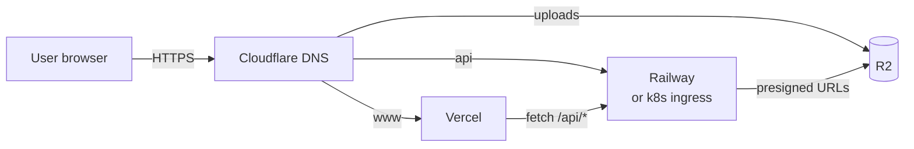

---

## 13. Scaling & Cost Model

| Phase | Hosting | Monthly est. | Capacity ceiling | Trigger to move |
|-------|---------|--------------|------------------|------------------|
| **1** | Vercel + Railway + Supabase + Upstash + R2 + LLM APIs | $130–210 | ~10 K MAU | Vercel function bill > $50/mo *or* API container saturating |
| **2** | DigitalOcean K8s (3 × s-2vcpu-4gb) + managed PG/Redis + R2 + LLM APIs | $170–255 (infra) + LLM | 50 K – 200 K MAU | Sustained ingress > 200 RPS *or* multi-region needed |
| **3** | Same + Cloudflare paid plans (WAF, Workers, Argo) | + $0–50 baseline (LLM dominates) | 200 K+ MAU | Geographic latency or DDoS pressure |

**Cost dominators at scale:**

1. **LLM tokens** — controlled via the kill-switch + cost-override admin panel, per-user budgets in `llm_usage`, and aggressive caching (Redis-backed `LlmCacheService`).
2. **Managed Postgres** — read replica strategy already in code (`DATABASE_READ_REPLICA_URL`); offload heavy analytics queries.
3. **R2 egress** — free between R2 and Workers; presigned URLs from web for direct download.

---

## Appendix A — File map for further reading

| Concern | Start here |
|---------|------------|
| Backend bootstrap | `apps/api/src/main.ts` |
| Module wiring | `apps/api/src/app.module.ts` |
| AI router | `apps/api/src/llm/llm.service.ts` |
| Agents | `apps/api/src/ai/agents/base-agent.ts` |
| Prisma schema | `apps/api/prisma/schema.prisma` |
| Tracing | `apps/api/src/tracing.ts` |
| Frontend layout | `apps/web/src/app/layout.tsx` |
| Auth store | `apps/web/src/lib/store.ts` |
| API client | `apps/web/src/lib/api.ts` |
| Firebase | `apps/web/src/lib/firebase.ts` |
| i18n | `apps/web/src/i18n/index.ts` |
| Offline engine | `apps/web/src/lib/offline-engine.ts` |
| k8s base | `k8s/base/` |
| Local stack | `docker-compose.yml` |
| Deployment guide | `docs/DEPLOYMENT.md` |
| Monetization | `docs/MONETIZATION_STRATEGY.md` |
